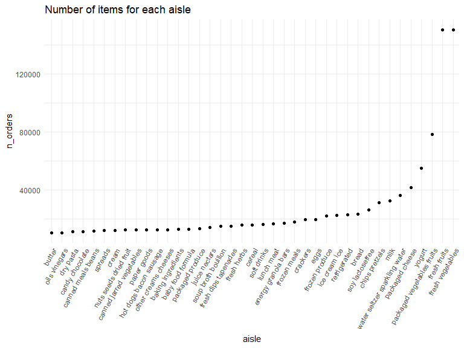
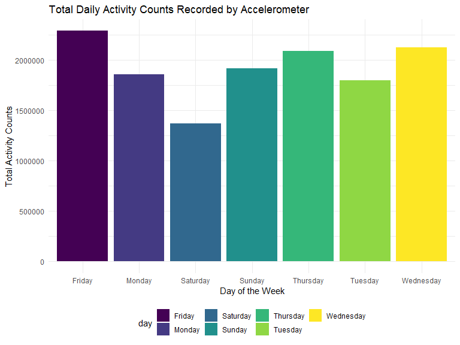
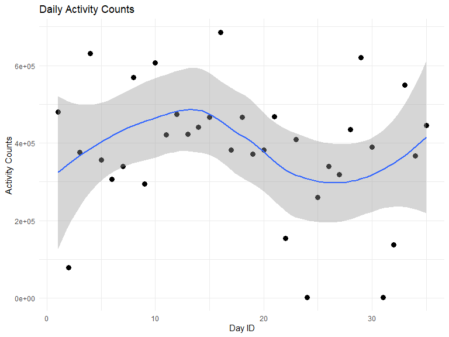
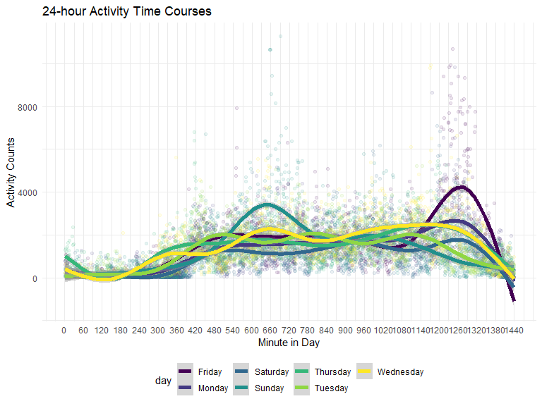

p8105_hw3_sl5232
================
Shangsi Lin
2022/10/12

## Problem 1

Load Data from p8015 dataset.

``` r
data("instacart")

instacart = 
  instacart %>% 
  as_tibble(instacart)
```

This dataset contains 1384617 rows and 15 columns, with each row
resprenting a single product from an instacart order. Variables include
identifiers for user, order, and product; the order in which each
product was added to the cart. There are several order-level variables,
describing the day and time of the order, and number of days since prior
order. Then there are several item-specific variables, describing the
product name (e.g. Yogurt, Avocado), department (e.g. dairy and eggs,
produce), and aisle (e.g. yogurt, fresh fruits), and whether the item
has been ordered by this user in the past. In total, there are 39123
products found in 131209 orders from 131209 distinct users.

``` r
aisle_df = instacart %>%
  count(aisle, name = "n_orders") %>% 
  arrange(desc(n_orders))
```

There are 134 distinct aisles, and the top five aisles from which most
items are ordered from arefresh vegetables, fresh fruits, packaged
vegetables fruits, yogurt, and packaged cheese.

``` r
aisle_df %>% 
  filter(n_orders > 10000) %>% 
  mutate(aisle = fct_reorder(aisle, n_orders)) %>% 
  ggplot(aes(x = aisle, y = n_orders)) + 
  geom_point() + 
  labs(title = "Number of items for each aisle") +
  theme(axis.text.x = element_text(angle = 60, hjust = 1))
```



The above code chunk makes a plot that shows the number of items ordered
in each aisle that has more than 10000 items ordered.Aisles are arranged
in a low to high fashion according to the number of items ordered.

``` r
instacart %>% 
  filter(aisle %in% c("baking ingredients", "dog food care", "packaged vegetables fruits")) %>%
  group_by(aisle) %>% 
  count(product_name) %>% 
  mutate(rank = min_rank(desc(n))) %>% 
  filter(rank < 4) %>% 
  arrange(desc(n)) %>%
  knitr::kable()
```

| aisle                      | product_name                                  |    n | rank |
|:---------------------------|:----------------------------------------------|-----:|-----:|
| packaged vegetables fruits | Organic Baby Spinach                          | 9784 |    1 |
| packaged vegetables fruits | Organic Raspberries                           | 5546 |    2 |
| packaged vegetables fruits | Organic Blueberries                           | 4966 |    3 |
| baking ingredients         | Light Brown Sugar                             |  499 |    1 |
| baking ingredients         | Pure Baking Soda                              |  387 |    2 |
| baking ingredients         | Cane Sugar                                    |  336 |    3 |
| dog food care              | Snack Sticks Chicken & Rice Recipe Dog Treats |   30 |    1 |
| dog food care              | Organix Chicken & Brown Rice Recipe           |   28 |    2 |
| dog food care              | Small Dog Biscuits                            |   26 |    3 |

The above code chunk shows the three most popular items and their
ordered times in each of the aisles “baking ingredients”, “dog food
care”, “packaged vegetables fruits”.

``` r
instacart %>%
  filter(product_name %in% c("Pink Lady Apples", "Coffee Ice Cream")) %>%
  group_by(product_name, order_dow) %>%
  summarize(mean_hour = mean(order_hour_of_day)) %>%
  spread(key = order_dow, value = mean_hour) %>%
  knitr::kable(digits = 2)
```

    ## `summarise()` has grouped output by 'product_name'. You can override using the
    ## `.groups` argument.

| product_name     |     0 |     1 |     2 |     3 |     4 |     5 |     6 |
|:-----------------|------:|------:|------:|------:|------:|------:|------:|
| Coffee Ice Cream | 13.77 | 14.32 | 15.38 | 15.32 | 15.22 | 12.26 | 13.83 |
| Pink Lady Apples | 13.44 | 11.36 | 11.70 | 14.25 | 11.55 | 12.78 | 11.94 |

The above code chunk shows the mean hour of the day at which Pink Lady
Apples and Coffee Ice Cream are ordered on each day of the week.

## Problem 2

First,load and clean the dataset. Used `pivot_longer` function to modify
the dataset to present each individual activity count with their
corresponding day id, week, and day of the week. A new parameter called
“day_type” is also introduced to indicate whether the particular
activity happened in a weekday or weekend.

``` r
accel_df = read.csv("data/accel_data.csv") %>% 
  janitor::clean_names() %>% 
  pivot_longer(
    cols = activity_1:activity_1440,
    names_to = "activity_number",
    values_to = "activity_counts"
  ) %>% 
  mutate(day_type = ifelse(day == ("Sunday") | day == ("Saturday"), "weekends", "weekdays")) %>% 
  mutate(activity_number = activity_number %>% str_replace("^[a-z, _]*", "")) %>% 
  mutate(activity_number = as.numeric(activity_number)) %>% 
  select(week, day_id, day, day_type, everything())
```

In total, there are 50400 observations and 6 variable classes in the
resulting dataset.

Next, make a table to show the total daily activities for each day.
Arrange them in decreasing order of the daily activity counts that each
day have.

``` r
accel_df %>% 
  group_by(day_id, day, day_type) %>% 
  summarize(daily_counts = sum(activity_counts)) %>% 
  arrange(desc(daily_counts)) %>% 
  knitr::kable()
```

    ## `summarise()` has grouped output by 'day_id', 'day'. You can override using the
    ## `.groups` argument.

| day_id | day       | day_type | daily_counts |
|-------:|:----------|:---------|-------------:|
|     16 | Monday    | weekdays |    685910.00 |
|      4 | Sunday    | weekends |    631105.00 |
|     29 | Friday    | weekdays |    620860.00 |
|     10 | Saturday  | weekends |    607175.00 |
|      8 | Friday    | weekdays |    568839.00 |
|     33 | Thursday  | weekdays |    549658.00 |
|      1 | Friday    | weekdays |    480542.62 |
|     12 | Thursday  | weekdays |    474048.00 |
|     21 | Wednesday | weekdays |    468869.00 |
|     15 | Friday    | weekdays |    467420.00 |
|     18 | Sunday    | weekends |    467052.00 |
|     35 | Wednesday | weekdays |    445366.00 |
|     14 | Wednesday | weekdays |    440962.00 |
|     28 | Wednesday | weekdays |    434460.00 |
|     13 | Tuesday   | weekdays |    423245.00 |
|     11 | Sunday    | weekends |    422018.00 |
|     23 | Monday    | weekdays |    409450.00 |
|     30 | Monday    | weekdays |    389080.00 |
|     17 | Saturday  | weekends |    382928.00 |
|     20 | Tuesday   | weekdays |    381507.00 |
|      3 | Saturday  | weekends |    376254.00 |
|     19 | Thursday  | weekdays |    371230.00 |
|     34 | Tuesday   | weekdays |    367824.00 |
|      5 | Thursday  | weekdays |    355923.64 |
|     26 | Thursday  | weekdays |    340291.00 |
|      7 | Wednesday | weekdays |    340115.01 |
|     27 | Tuesday   | weekdays |    319568.00 |
|      6 | Tuesday   | weekdays |    307094.24 |
|      9 | Monday    | weekdays |    295431.00 |
|     25 | Sunday    | weekends |    260617.00 |
|     22 | Friday    | weekdays |    154049.00 |
|     32 | Sunday    | weekends |    138421.00 |
|      2 | Monday    | weekdays |     78828.07 |
|     24 | Saturday  | weekends |      1440.00 |
|     31 | Saturday  | weekends |      1440.00 |

From the above table we can see that among the top 10 days with the most
daily activities, only 2 of them are weekends, which implies that
activities are less during weekends. For further investigation, a
histogram showing the total daily activity counts for each day of the
week across the five week recording period is made.

``` r
accel_df %>%
  group_by(day) %>%
  summarize(daily_counts = sum(activity_counts)) %>% 
  ggplot(aes(x = day, y = daily_counts, fill = day)) + 
  geom_histogram(stat = "identity") + 
  labs(
    x = "Day of the Week",
    y = "Total Activity Counts",
    title = "Total Daily Activity Counts Recorded by Accelerometer"
  ) 
```



From the above histogram we can see that Saturday has the least amount
of total daily activity while Friday has the most total daily activity.
To investigate the trend for each individual day, a scatterplot is made
below.

``` r
accel_df %>%
  group_by(day_id) %>%
  summarize(daily_counts = sum(activity_counts)) %>% 
  ggplot(aes(x = day_id, y = daily_counts)) + 
  geom_point(size = 3) +
  geom_smooth(se = TRUE) +
  labs(
    title = "Daily Activity Counts",
    x = "Day ID",
    y = "Activity Counts"
  )
```

    ## `geom_smooth()` using method = 'loess' and formula 'y ~ x'



From the scatter plot above, not much useful information can we gain as
the trend line moved up and down and eventually up again throughout the
recorded period, with relatively large confidence interval. There are
very large differences between each individual day so more data is
needed for a clear trend.

The code below will generate a 24-hour activity time courses for each
day and each color to indicate the day of the week.

``` r
accel_df %>%
  group_by(day, activity_number) %>%
  mutate(minute_counts = sum(activity_counts)) %>% 
  distinct(day, activity_number, minute_counts) %>%  
  ggplot(aes(x = activity_number, y = minute_counts, color = day)) + 
  geom_point(alpha = 0.1) +
  geom_smooth(se = TRUE, size = 3) +
  labs(
    title = "24-hour Activity Time Courses",
    x = "Minute in Day",
    y = "Activity Counts"
  ) +
  scale_x_continuous(breaks = seq(0, 1440, by = 60))
```

    ## `geom_smooth()` using method = 'gam' and formula 'y ~ s(x, bs = "cs")'



By reading the graph above and focusing on its trendlines, we observe
that activities are relatively low in the beginning of the 300 minutes
of the day, possibly due to sleep. Then activity counts rises between
300 minutes to 420 minutes of the day, and stays relatively high and
steady from 420 minutes to 1260 minutes of the day. In the end of the
day from 1260 minutes to 1440 minutes, the activity counts drop
substantially. It is worth to note that Sunday and Friday have special
peaks of activity counts at around 660 minutes and 1260 minutes,
respectively. Thus we can conclude that activity counts are closely
linked to the status of the individual wearing the accelerometer, the
activity counts are high when he is awake and low when he goes to bed.
